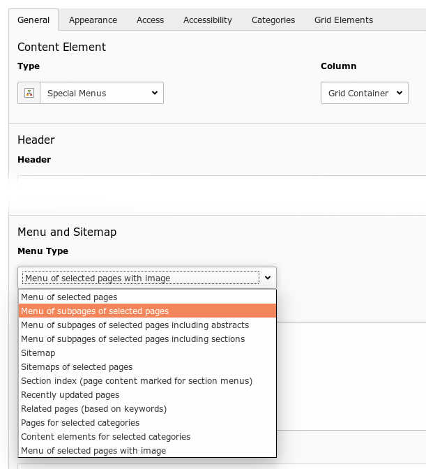
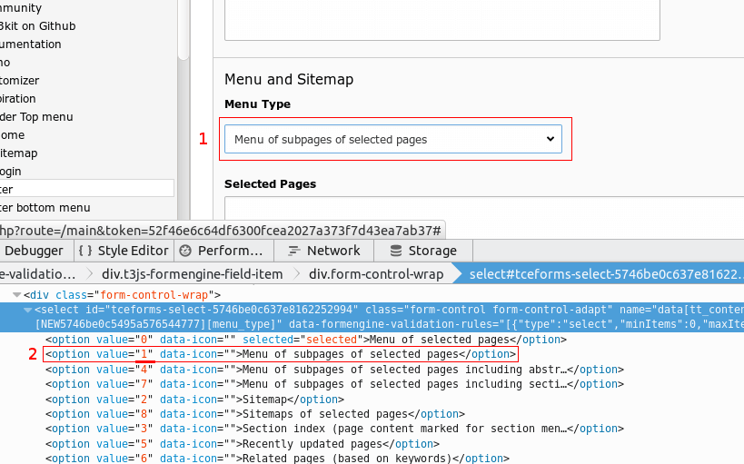

# Custom Special Menu templates

## Introduction ##

t3kit and recent versions of TYPO3 are using the "Fluid Styled Content"-extension instead of "CSS Styled Content". The biggest difference being that it is Fluid-driven instead of Typoscript-driven (with performance gains).

If you'd like to create a new type of Special Menus (part of Fluid Styled Content-extension), here is how.

##Create a new Menu Type##
Choose a partial-template you want to use (from the original extension) as your starting point and copy it to fileadmin. You can locate the original id by inspecting the dropdown in backend. In this case we want to use "Menu of subpages of selected pages" as a starting point, which is value 1.

