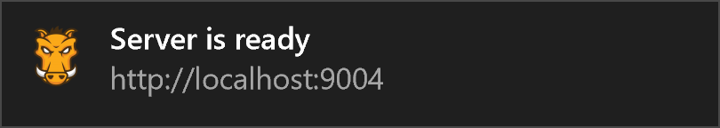

# Development

1. Open in terminal your project folder, for example ```felayout_projectName```
2. Then use command ```grunt``` to start static web server with livereload. This won’t open static server automatically (by default). When it’s ready you will see this info window in the right bottom side of (main) screen

3. To open static server in your browser you should enter http://localhost:9004/ into address bar. 
You also can open site on others devices http://your-ip-address:9004/.


