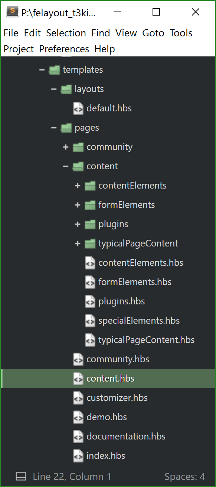
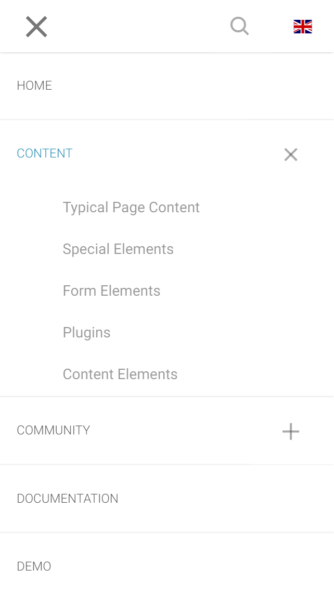

# File structure


## Root files
* **.bowerrc** - configuration file with JSON object for Bower
* **.csslintrc** - configuration file with JSON object of CSS standards that operated by CSS Linter
* **.editorconfig** - configuration file for unifying coding style for different editors and IDEs
* **.gitattributes** - configuration file for ensuring line endings are normalized
* **.gitignore** - file for determining what files and directories should be ignored by Git
* **.htmlhintrc** - configuration file with JSON object of HTML standards operated by HTML Hint
* **.jscsrc** - configuration file for JavaScript code style checker
* **.jshintrc** - configuration file with JSON object for JSHinter
* **bower.jso**n - JSON function file with collection of Bower components
* **CHANGELOG.md** - markdown document with changes on this stage of development t3kit project
* **Gruntfile.js** - file with configurations of Grunt
* **package.json** - JSON function file with information about project; development dependencies (devDependencies) - this is set of grunt plugins required to develop
* **README.md** - markdown document with information about project, how to install and get working with t3kit project


## Folders
* **dev** - development directory. Consists of project dependencies (bower_components), JS, CSS, images, fonts, favicons, templates, e.t.c..
  * **bower_components** - this folder collects all project’s dependencies, defined in **bower.json** file. You can add other Bower components to project by including them in **bower.json** file and then run ```bower install``` command (make sure bower installed)
  * **copyToRoot** - this folder contain files that should be moved to root folder of deployed site - this is favicons and required for including favicons files
  * **fonts** - this folder contain files with fonts that cannot be included in other way. This is special fonts, like Icons, corporative font and so on. 
In other case, we should use **[Google web fonts](google.com/fonts)** that can be included in HEAD tag; or using **[localfont.com](localfont.com)** that profide us wide selection of fonts that can be included in CSS file
  * **images** - this folder contain images used on site. All images added to this folder will be automatically optimized by **imagemin.js** - one of the NPM plugins
  * **js** - this folder contain all JavaScript files. All new files should be included to **main.js** file (or to **sub files** that already included to **main.js**)
Local scripts (running only on local machine) should be included to local.js
  * **styles** - folder with LESS files. 
    * **bootstrap.less** - LESS file with included styles of Bootstrap elements involved into project. You can comment or uncomment some of them if needed.
    * **components.less** - LESS file with included styles of Bower components involved into project. You can add Bower components added them in **bower.json** file.
    * **customVariables.less** - file with LESS variables used to configure Bootstrap and can be used in other LESS files, in case if it’s included into it
    * **local.less** - LESS file with styling of local elements
    * **main.less** - main LESS file with including of all files with styling of project elements, such like header, footer, slider, subnavigation, e.t.c..
To this file we can include all styles of new elements
    * **local (folder)** - folder with styles of local elements
    * **main (folder)** - folder with styles of all elements of the project
  * **templates** - folder with handlebars templates. We build templates using **handlebars** template language and **assemble system** with some useful helpers. Also it is very similar to Fluid templates. We use one layout and pages based on this layout. Also we can use partials in layout and pages.

Hierarchy of links in **Main navigation** for fe_layout based on files and folders relations. For example, if file and folder on same level has same names, files in folder will be children of this file, no needs to point parent file’s title. 
| 0:0 | 1:0 |
| -- | -- |


dfeh


