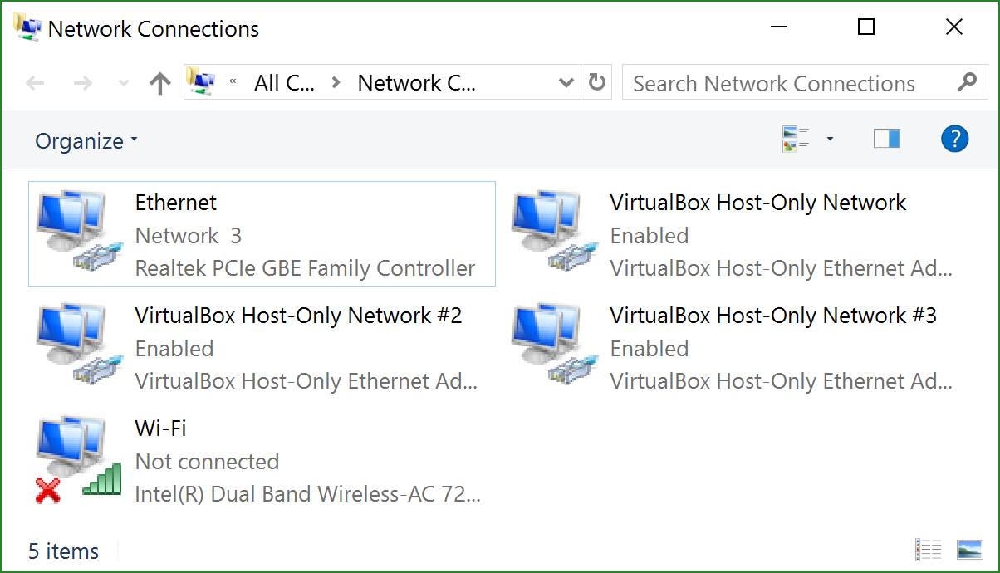
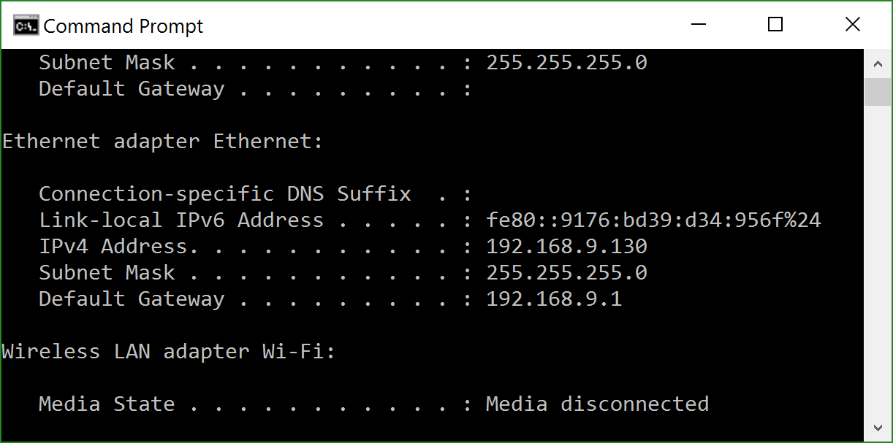
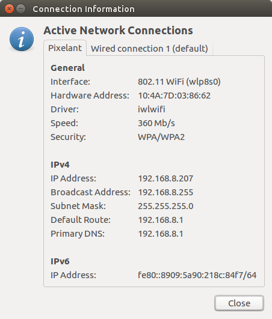
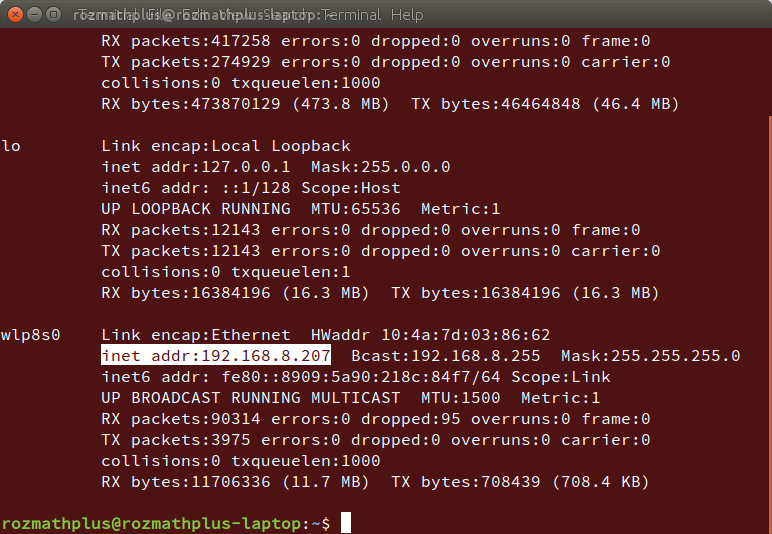
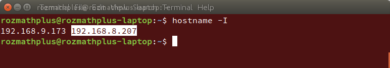

# How to get your IP-address?


## Windows
1. (optional) Take a look on current Internet connection (Network Connections folder)

2. Run in command prompt ```ipconfig``` command and find information about connection

Now we can see your IP from “IPv4 Address” line of current connection. This is, in our case, **192.168.9.130**.
Address for connection to local server, in this case, will be **http://192.168.9.130:9004/**


---


## Linux
1. (Ubuntu - With GUI) Take a look on Connection Information.

2. (Ubuntu - Terminal) Run in Terminal ```ifconfig -a``` command to show all network info.


(All Linux-based OS) Or run in Terminal to get short information:
```
hostname -I```



---


## Mac
```Need to add info for Mac OS```

---

Livereload also will work on different devices. It means you can edit your site and see changes on all your devices without reload page.


