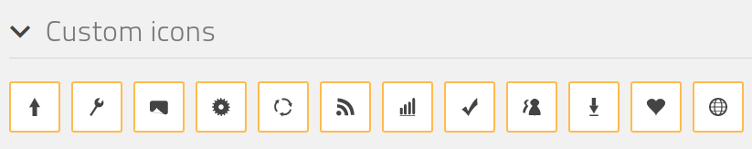

# How to add custom icons

Open `selection.json` file in [IcoMoon](https://icomoon.io/) app. Edit/add custom icons. 



After editing - select custom icons to add them to set. 

Press "Generate font" and download it with configuration:
  - Font name: "icons"
  - Class prefix: "icon-"
  
Unzip IcoMoon archive and place all content to "/fileadmin/custom/icons"

Structure:
```
  ├──demo-files (optional)
  |  ├──demo.css
  |  └──demo.js
  |
  ├──fonts
  |  ├──icons.eot
  |  ├──icons.svg
  |  ├──icons.ttf
  |  └──icons.woff
  |
  ├──Read Me.txt (optional)
  ├──demo.html (optional)
  ├──selection.json
  └──style.css
```
  
Page -> Home -> Edit -> Resources 
```
Add this lines to Page TSConfig
TCEFORM.tt_content.pi_flexform.bigIconTextButton.sDEF.iconClass {
    config {
        cssFile = fileadmin/custom/icons/style.css
    }
}
````

