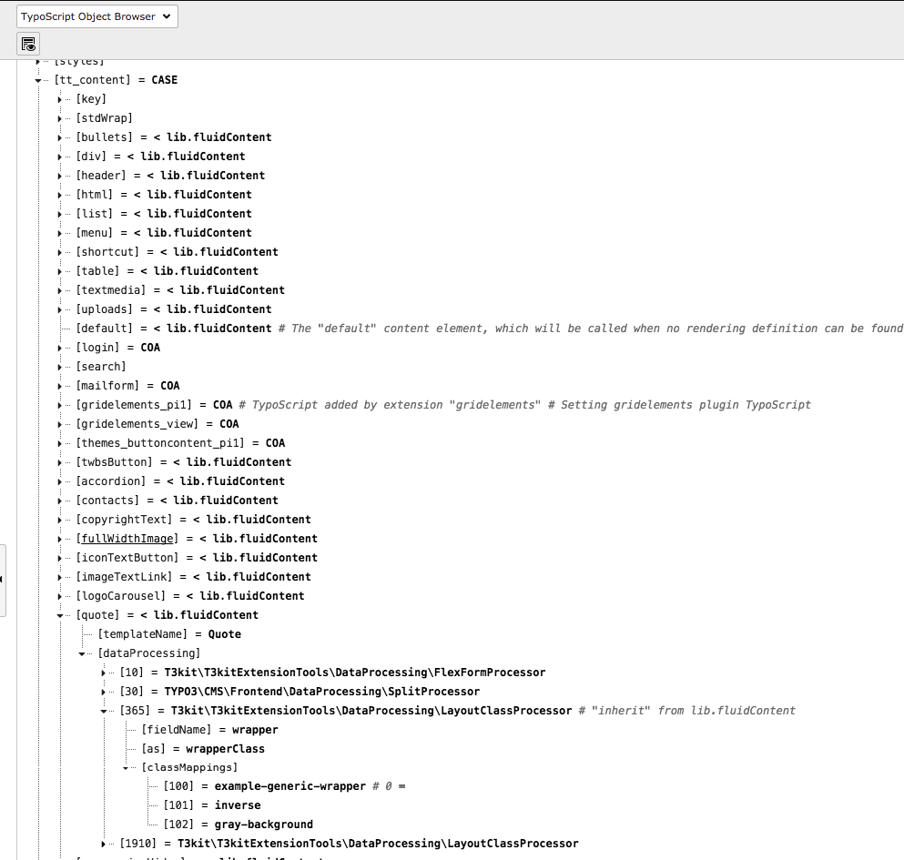
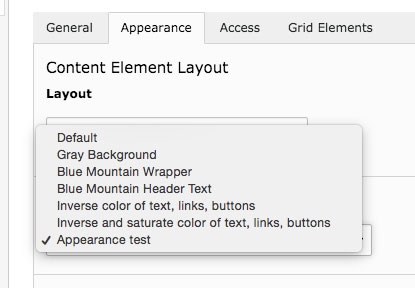

# How to add new appearance content wrappers

Adding a appearance content wrapper will wrap the class of the content element. This can be helpful when you want an element to look different from the original element.

The procedure is almost the same as adding a new [layout content wrapper](https://pixelant.gitbooks.io/doc/content/how_to_add_new_layout_content_wrappers.html) but with some small changes.

**Step 1.**   
Find the elements pagets and setupts files (located in [```theme_t3kit/Configuration/ContentElements/```](https://github.com/t3kit/theme_t3kit/tree/master/Configuration/ContentElements))  you want to add a appearance wrapper to.  
For this example we will use the "Quote" elements [pagets](https://github.com/t3kit/theme_t3kit/blob/master/Configuration/ContentElements/Quote.pagets) and [setupts](https://github.com/t3kit/theme_t3kit/blob/master/Configuration/ContentElements/Quote.setupts).  

**Step 2.**   
Inside the [pagets](https://github.com/t3kit/theme_t3kit/blob/master/Configuration/ContentElements/Quote.pagets) file we will find a section that is commented out with a set of instruction:
```
# # Use layout field to customize Layout select-box on quote
# # extend layout select-box only for this element
# TCEFORM.tt_content.layout {
#     types {
#         quote {
#             addItems {
#                 --div-- = Quote layouts:
#                 # add value with index 0, to set it as a default, only for this element
#                 0 = Default layout for this element
#                 11 = Example layout only for quote
#             }
#         }
#     }
# }
```
Copy this block of text.

**Step 3.**  
Edit rootpage of your site   
Click on the "Resources" tab  
In TypoScript Configuration there is "Page TSConfig".    
Here you will add the copied block of text and remove the "#" from each row.  
Remove the "```layout```" from ```TCEFORM.tt_content.layout``` and add "```wrapper```" so it becomes ```TCEFORM.tt_content.wrapper```
Remove the ```0 = Default layout for this element``` and ```11 = Example layout only for quote```  and we need to find a number that is not occupied already.

**Step 4.**  
Duplicate your browser tab and choose "Template" from the TYPO3 menu.  
Choose rootpage.  
The dropdown should have "Typoscript Object Browser" selected.  
Navigate to ```tt_content.quote.dataProcessing.360.classMappings``` in the tree. 


Here we can see that the numbers 100,101,102 are occupied, so we can not use these.

**Step 5.**  
Go back to the previous browser tab and add a number of your choosing with the name of your choosing.   
It should look something like this now:
```
# # Use layout field to customize Layout select-box on quote
# # extend layout select-box only for this element
 TCEFORM.tt_content.wrapper {
     types {
         quote {
             addItems {
                 --div-- = Quote layouts:
                 99 = Super example for this element
             }
         }
     }
 }
```
Save.

Now we have the layout wrapper visible in the backend for this element and it will look like this:  
  
  
  **Step 6. **  
  Now we need to add the class to this layout wrapper. 
Open the [setupts](https://github.com/t3kit/theme_t3kit/blob/master/Configuration/ContentElements/Quote.setupts) for the element and copy the entire text:
```
tt_content {
    quote =< lib.fluidContent
    quote {
        templateName = Quote
        dataProcessing {
            10 = T3kit\T3kitExtensionTools\DataProcessing\FlexFormProcessor
            10 {
                fieldName = pi_flexform
                as = settings
            }
            30 = TYPO3\CMS\Frontend\DataProcessing\SplitProcessor
            30 {
                fieldName = header
                delimiter = ,
                as = headers
            }
            # "inherit" from lib.fluidContent
            365 < lib.fluidContent.dataProcessing.365
            1910 < lib.fluidContent.dataProcessing.1910

            # extend class mapping only for this element
            # 1910 {
                # classMappings {
                    # # Override the standard default
                    # 0 = default-class
                    # 11 = example-class
                # }
            # }
        }
    }
}
```
This will be copied into our setup typoscript.  
Choose "Template" from the TYPO3 menu.  
Choose rootpage.  
The dropdown should have "Info/Modify" selected.  
Click on "Setup".  
Add the block of text.  
Now we need to remove what is not needed. 
It will look something like this:
```
tt_content {
       quote {
        dataProcessing {
            365 {
                classMappings {
                    99 = appearance-test
                 }
             }
        }
    }
}
```
Save.
