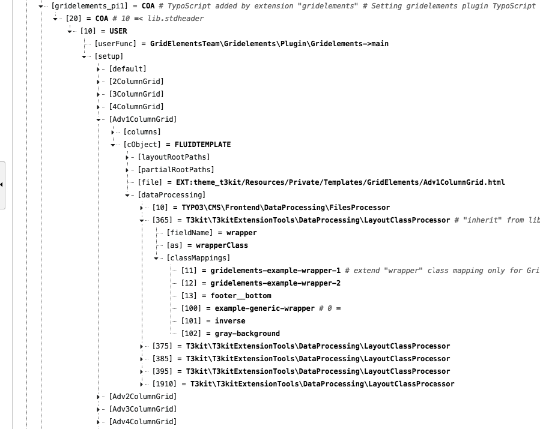

# How to add new appearance column wrappers

Adding a wrapper to the column can be helpful when you want the it to look different from the original columns styling.

In this example we will be adding wrappers to all the advanced column grids.

**Step 1.** Find the "```AdvancecColumnGrid```" [pagets](https://github.com/t3kit/theme_t3kit/blob/master/Configuration/GridElements/PageTS/AdvColumnGrid.pagets) file (located in [```theme_t3kit/Configuration/GridElements/PageTS/```](https://github.com/t3kit/theme_t3kit/blob/master/Configuration/GridElements/PageTS/)).  

**Step 2.** Inside the [pagets](https://github.com/t3kit/theme_t3kit/blob/master/Configuration/ContentElements/Quote.pagets) file we will find a section that we will need:
```
# Add a wrapper to Gridelements
# Items in "wrapper" select box will appear in all grid elements on the site.
TCEFORM.tt_content.wrapper {
   types {
       gridelements_pi1 {
           # Based on that the default items still exists.
           addItems {
                --div-- = Gridelements wrappers:
                11 = Example Gridelements wrapper 1
                12 = Example Gridelements wrapper 2
                13 = Footer bottom row wrapper
           }
       }
   }
}
```
Copy this block of text.

**Step 3.**  
Edit rootpage of your site   
Click on the "Resources" tab  
In TypoScript Configuration there is "Page TSConfig".    
Here you will add the copied block of text.  
Remove this part: 
```
11 = Example Gridelements wrapper 1
12 = Example Gridelements wrapper 2
13 = Footer bottom row wrapper
```
And we need to find a number that is not occupied already.

**Step 4.**  
Duplicate your browser tab and choose "Template" from the TYPO3 menu.  
Choose rootpage.  
The dropdown should have "Typoscript Object Browser" selected.  
Navigate to ```tt_content.gridelements_pi1.20.10.setup.Adv1ColumnGrid.cObject.dataProcessing.365.classMappings``` in the tree. 

Here we find that 11,12,13,100,101,102 are occupied, so we can not use these.

**Step 5.**  
Go back to the previous browser tab and add a number of your choosing with the name of your choosing.
It should look something like this now:
```
# Add a wrapper to Gridelements
# Items in "wrapper" select box will appear in all grid elements on the site.
TCEFORM.tt_content.wrapper {
   types {
       gridelements_pi1 {
           # Based on that the default items still exists.
           addItems {
                --div-- = Gridelements wrappers:
                99 = Light-Gray background
           }
       }
   }
}
```