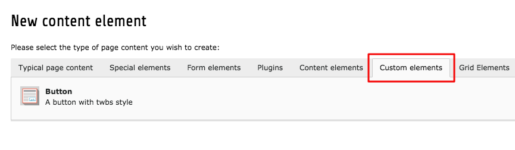

# How to create new content elements

This process simplifies the steps of creating new content elements, as it auto-generates most of the files/folders we need.


####Step 1

1. Edit rootpage  
1. Click on the "**Resources**" tab
1. In TypoScript Configuration there is "**Available Items**".   
1. Find: "**EXT:theme_t3kit :: Enable Custom Content Elements (fileadmin/templates/...) (theme_t3kit)**" and click it. It should now appear in the "**Selected Items**" box.

Save.

####Step 2
1. Choose "**Template**" from the typo3 menu.   
1. Choose rootpage.
1. The dropdown should have "**Info/Modify**" selected.  
1. Click on "**Edit the whole template record**"
1. Click on "**Includes**" tabs.  
1. In the "Available Items", find "**EXT:theme_t3kit :: Enable Custom Content Elements (fileadmin/templates/...) (theme_t3kit)**" and click it.  
1. Check in the "**Selected Items**" that the "**EXT:theme_t3kit :: Enable Custom Content Elements (fileadmin/templates/...) (theme_t3kit)**" is there now.

Save. 


---


You will now have a new tab called "**Custom elements**" when creating elements, with your new content element: 
In the "**Filelist**", there will now be new created folders and files:
(**fileadmin/templates/theme_t3kit/custom_content_elements/**)


```
.
|____Configuration
| |____Backend
| | |____ext_tables.php
| |____FlexForms
| | |____flexform_twbsButton.xml
| |____PageTS
| | |____twbsButton.pagets
| | |____WizardTabs.pagets
| |____TCA
| | |____Overrides
| | | |____tt_content.php
| |____TypoScript
| | |____twbsButton.setupts
|____Resources
| |____Private
| | |____Language
| | | |____CustomContentElements.xlf
| | |____Templates
| | | |____CustomContentElements
| | | | |____TwbsButton.html
| |____Public
| | |____Backend
| | | |____Icons
| | | | |____CustomContentElements
| | | | | |____customElement.svg```

Configuration folder:  
ext_tables.php  
flexform_twbsButton.xml  
twbsButton.pagets  
WizardTabs.pagets  
tt_content.php  
twbsButton.setupts

Resources folder:  
CustomContentElements.xlf  
TwbsButton.html  
customElement.svg


