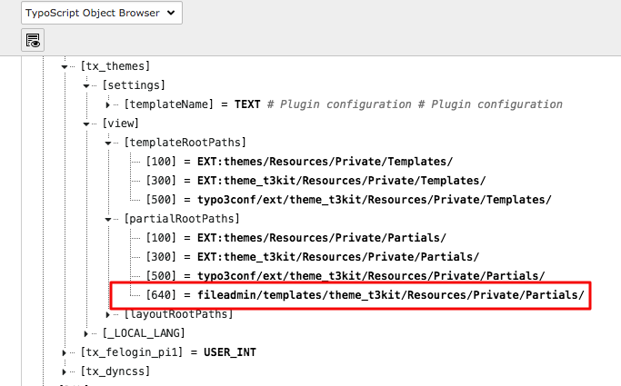

# How to edit partials and templates (header, footer)

###Step 1

Create the folder structure in *fileadmin/templates/theme_t3kit* for the new file you want to edit.  
For example, if you want to change the header, find the original file (from git or within the project) and folder structure:
***theme_t3kit/Resources/Private/Partials/Header/*** 

Inside your new ***/Header/*** folder, create the new header with the same name as the original filename **"Header.html"**

Copy the content from the [original file](https://github.com/t3kit/theme_t3kit/blob/master/Resources/Private/Partials/Header/Header.html) and place it into your new "Header.html" file. 

###Step 2

Choose **"Template"** in TYPO3 menu.   
Be sure you are on the rootpage.  
Select **"Info/modify"** from the dropdown if it is not already set.  
Click on **"Setup"**

Now you have to create a new partialRoothPath for your new header.  
Add the following typoscript:  
```
plugin.tx_themes {  
    view {  
        partialRootPaths {  
            640 = fileadmin/templates/theme_t3kit/Resources/Private/Partials/  
        }  
    }  
}  ```
The number **640** is the value we give to the new PartialRootPath. By default, 100, 300, 500 are already set to the original folder of partialRootPaths.  
If you want to make sure that the value you want to use is not already set, you can check it with the **"TypoScript Object Browser"** and find *tx_themes* -> *view* -> *partialRootPaths* and see what values are aldready set. 

  
  
###Step 3

Now you can start editing your copy of the **"Header.html"**

