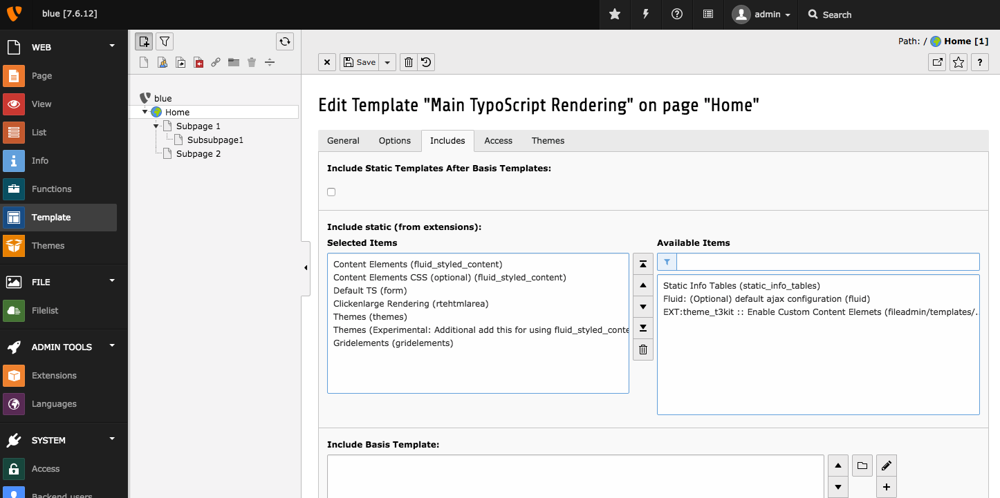

# Install t3kit bluemountain on existing installation

The easiest way to install t3kit bluemountain theme is to manage it with composer. This composer file shows smallest possible configuration needed in root composer file:
```
{
  "repositories": [
    {
      "type": "composer",
      "url": "https://composer.typo3.org/"
    },
    {
      "type": "git",
      "url": "https://github.com/t3kit/theme_t3kit_bluemountain"
    }
  ],
  "require": {
    "php": ">=5.5, <7.1",
    "typo3/cms": "^7.6",
    "typo3-ter/theme-t3kit-bluemountain": "0.5.0"
  },
  "extra": {
    "typo3/cms": {
      "cms-package-dir": "{$vendor-dir}/typo3/cms",
      "web-dir": "."
    }
  }
}
```

This will download all needed extensions, namely: dyncss, dyncss_less, gridelements, static_info_tables, t3kit_extension_tools, themes, theme_t3kit and of course theme_t3kit_bluemountain in their required versions. (Please doublecheck that 0.5.0 is in fact the latest theme release in the composer.typo3.org).

If you are not using composer, you can of course choose to install all of these extensions manualy from TER. Find respective versions needed in ext_emconf.php file here: https://github.com/t3kit/theme_t3kit_bluemountain/blob/master/ext_emconf.php

Afterwards you need to install them in this order: 
static info tables, themes, gridelements, dyncss, dyncss_less, t3kit_extension_tools, theme_t3kit, theme_t3kit_bluemountain

Your installation should use fluid_styled_content for content element rendering. Then you need to add static template typoscript from these extensions and remove all default typoscript for page generation. 


Last step is activating theme and selecting backend layout for pages. 


If you do not use solr search, you will get an fatal error that solr search libraries are missing. You can remove this error by disabling rendering search fields from solr using these 3 lines in typoscript:
```
lib.header.middle.search >
lib.header.top.search >
lib.menu.main.search >
```