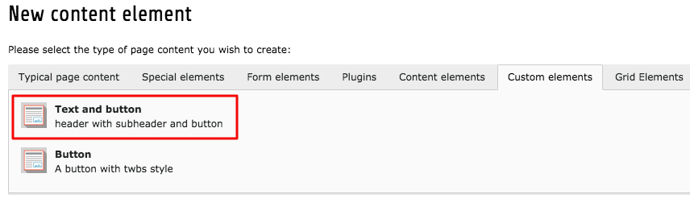
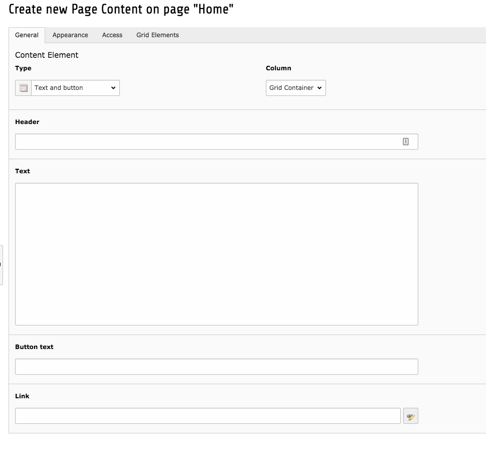

# New content element example

In this example we will create a new content element which contains a header, text field and a button. A good start would be to find a similar template to which we want to create so we can use it as a base. 

The **"[IconTextButton](https://github.com/t3kit/theme_t3kit/blob/master/Resources/Private/Templates/ContentElements/IconTextButton.html)"** already has a text and button in its template so we will use that one.   
Copy the template and place it in the *custom_content_elements/Resources/Templates/CustomContentElements/* folder and name the template.

Either make the necessary changes to the template now or later on.  

Copy the [pageTS](https://github.com/t3kit/theme_t3kit/blob/master/Configuration/ContentElements/IconTextButton.pagets) and place in the *custom_content_elements/Configuration/PageTS/* folder and make sure you make the necessary changes. 

The original copied file looked like this:
```
mod.wizards.newContentElement.wizardItems.contentElements {
    elements {
        iconTextButton {
            title = LLL:EXT:theme_t3kit/Resources/Private/Language/ContentElements.xlf:iconTextButton.title
            description = LLL:EXT:theme_t3kit/Resources/Private/Language/ContentElements.xlf:iconTextButton.description
            iconIdentifier = content-elements-iconTextButton
            tt_content_defValues {
                CType = iconTextButton
            }
        }
    }
    show := addToList(iconTextButton)
}

TCEFORM.tt_content.pi_flexform.iconTextButton.sDEF.iconClass {
    addItems {
        0 = LLL:EXT:theme_t3kit/Resources/Private/Language/ContentElements.xlf:icon.flexform.iconClass_none
    }
}
```
Which will now be changed to this:

```
mod.wizards.newContentElement.wizardItems.customContentElements { 
    elements {
        textButton {   
            title = LLL:fileadmin/templates/theme_t3kit/custom_content_elements/Resources/Private/Language/CustomContentElements.xlf:textButton.title
            description = LLL:fileadmin/templates/theme_t3kit/custom_content_elements/Resources/Private/Language/CustomContentElements.xlf:textButton.description
            iconIdentifier = custom-content-elements-textButton
            tt_content_defValues {
                CType = textButton
            }
        }
    }
    show := addToList(textButton)
}
```
Copy the [setupTS](https://github.com/t3kit/theme_t3kit/blob/master/Configuration/ContentElements/IconTextButton.setupts) and place in the *custom_content_elements/Configuration/TypoScript/*  

The original copied file looked like this:

```
tt_content {
    iconTextButton =< lib.fluidContent
    iconTextButton {
        templateName = iconTextButton

        dataProcessing {

            10 = T3kit\T3kitExtensionTools\DataProcessing\FlexFormProcessor
            10 {
                fieldName = pi_flexform
                as = settings
            }
            # "inherit" from lib.fluidContent
            365 < lib.fluidContent.dataProcessing.365
            1910 < lib.fluidContent.dataProcessing.1910

            # extend class mapping only for this element
            # 1910 {
                # classMappings {
                    # # Override the standard default
                    # 0 = default-class
                    # 11 = example-class
                # }
            # }
        }
    }
}
```
Which will now be changed to this:

```
tt_content {
    textButton =< lib.fluidContent
    textButton {
        templateName = TextButton

        dataProcessing {

            # "inherit" from lib.fluidContent
            365 < lib.fluidContent.dataProcessing.365
            1910 < lib.fluidContent.dataProcessing.1910

            # extend class mapping only for this element
            # 1910 {
                # classMappings {
                    # # Override the standard default
                    # 0 = default-class
                    # 11 = example-class
                # }
            # }
        }
    }
}
```
In the *custom_content_elements/Configuration/TCA/Overrides/* folder we will open the tt_content.php file and add the configurations for what fields will be available in the backend form. This can also be copied from the orignal [tt_content.php](https://github.com/t3kit/theme_t3kit/blob/master/Configuration/TCA/Overrides/tt_content.php) file but be sure to only copy what you need and make the necessary modifications.

What we need from the original file is to define the Ctype:
```php
    // "iconTextButton"
    \TYPO3\CMS\Core\Utility\ExtensionManagementUtility::addTcaSelectItem(
        'tt_content',
        'CType',
        [
            $contentElementLanguageFilePrefix . 'iconTextButton.title',
            'iconTextButton',
            'content-elements-iconTextButton'
        ],
        'bigIconTextButton',
        'after'
    );
	$GLOBALS['TCA']['tt_content']['ctrl']['typeicon_classes']['iconTextButton'] = 'content-elements-iconTextButton';
    ```

and the palette:

```php
    // "iconTextButton"
    $GLOBALS['TCA']['tt_content']['types']['iconTextButton'] = [
        'showitem' => '
                --palette--;' . $frontendLanguageFilePrefix . 'palette.general;general,
                header;' . $cmsLanguageFilePrefix . 'header_formlabel,
                --linebreak--,bodytext;' . $contentElementLanguageFilePrefix . 'iconTextButton.bodytext,
                --linebreak--,subheader;' . $contentElementLanguageFilePrefix . 'iconTextButton.buttonText,
                --linebreak--,header_link;' . $cmsLanguageFilePrefix . 'header_link_formlabel,
                --linebreak--,pi_flexform;' . $contentElementLanguageFilePrefix . 'tt_content.tabs.settings,
            --div--;' . $frontendLanguageFilePrefix . 'tabs.appearance,
                --palette--;LLL:EXT:frontend/Resources/Private/Language/locallang_ttc.xlf:palette.frames;frames,
                --palette--;' . $frontendLanguageFilePrefix . 'palette.appearanceLinks;appearanceLinks,
            --div--;' . $frontendLanguageFilePrefix . 'tabs.access,
                hidden;' . $frontendLanguageFilePrefix . 'field.default.hidden,
                --palette--;' . $frontendLanguageFilePrefix . 'palette.access;access,
            --div--;' . $frontendLanguageFilePrefix . 'tabs.extended
        '
    ];
    ```
    
  These will be added and modified like so:
  
  Ctype:
  
  ```php
    // "textButton"
    \TYPO3\CMS\Core\Utility\ExtensionManagementUtility::addTcaSelectItem(
        'tt_content',
        'CType',
        [
            $customContentElementFilePrefix . 'textButton.title',
            'textButton',
            'custom-content-elements-textButton'
        ],
        'twbsButton',
        'after'
    );
    $GLOBALS['TCA']['tt_content']['ctrl']['typeicon_classes']['textButton'] = 'custom-content-elements-textButton';
    ```

    
Palette:
    
  ```php
      // "textButton"
    $GLOBALS['TCA']['tt_content']['types']['textButton'] = [
        'showitem' => '
                --palette--;' . $frontendLanguageFilePrefix . 'palette.general;general,
                header;' . $cmsLanguageFilePrefix . 'header_formlabel,
                --linebreak--,bodytext;' . $customContentElementFilePrefix . 'textButton.bodytext,
                --linebreak--,subheader;' . $customContentElementFilePrefix . 'textButton.buttonText,
                --linebreak--,header_link;' . $cmsLanguageFilePrefix . 'header_link_formlabel,
            --div--;' . $frontendLanguageFilePrefix . 'tabs.appearance,
                --palette--;LLL:EXT:frontend/Resources/Private/Language/locallang_ttc.xlf:palette.frames;frames,
                --palette--;' . $frontendLanguageFilePrefix . 'palette.appearanceLinks;appearanceLinks,
            --div--;' . $frontendLanguageFilePrefix . 'tabs.access,
                hidden;' . $frontendLanguageFilePrefix . 'field.default.hidden,
                --palette--;' . $frontendLanguageFilePrefix . 'palette.access;access,
            --div--;' . $frontendLanguageFilePrefix . 'tabs.extended
        '
    ];
    ```

Next is to add the description for the new elements in the **CustomContentElements.xlf** file located in the  *custom_content_elements/Resources/Private/Language/* folder. It will look something like this:

```xml
            <trans-unit id="textButton.title">
                <source>Text and button</source>
            </trans-unit>
            <trans-unit id="textButton.description">
                <source>header with subheader and button</source>
            </trans-unit>
            <trans-unit id="textButton.buttonText">
                <source>Button text</source>
            </trans-unit>
            <trans-unit id="textButton.link">
                <source>Link</source>
            </trans-unit>
            <trans-unit id="textButton.bodytext">
                <source>Text</source>
            </trans-unit>
            ```
           
Last step is to add either a new icon or use the one we already have (which we will do now). In the *custom_content_elements/Configuration/Backend/* folder there is the **ext_tables.php** file, open it and copy the necessary code snippet:

```php
        // twbsButton
        $iconRegistry->registerIcon(
            'custom-content-elements-twbsButton',
            \TYPO3\CMS\Core\Imaging\IconProvider\SvgIconProvider::class,
            ['source' => $customContentElementIconFilePrefix .  'customElement.svg']
        );
        ```
and make the changes needed:

```php
        // twbsButton
        $iconRegistry->registerIcon(
            'custom-content-elements-textButton',
            \TYPO3\CMS\Core\Imaging\IconProvider\SvgIconProvider::class,
            ['source' => $customContentElementIconFilePrefix .  'customElement.svg']
        );
        
        ```
        
Clear some caches and you should be able to see your new content element in the backend:





       