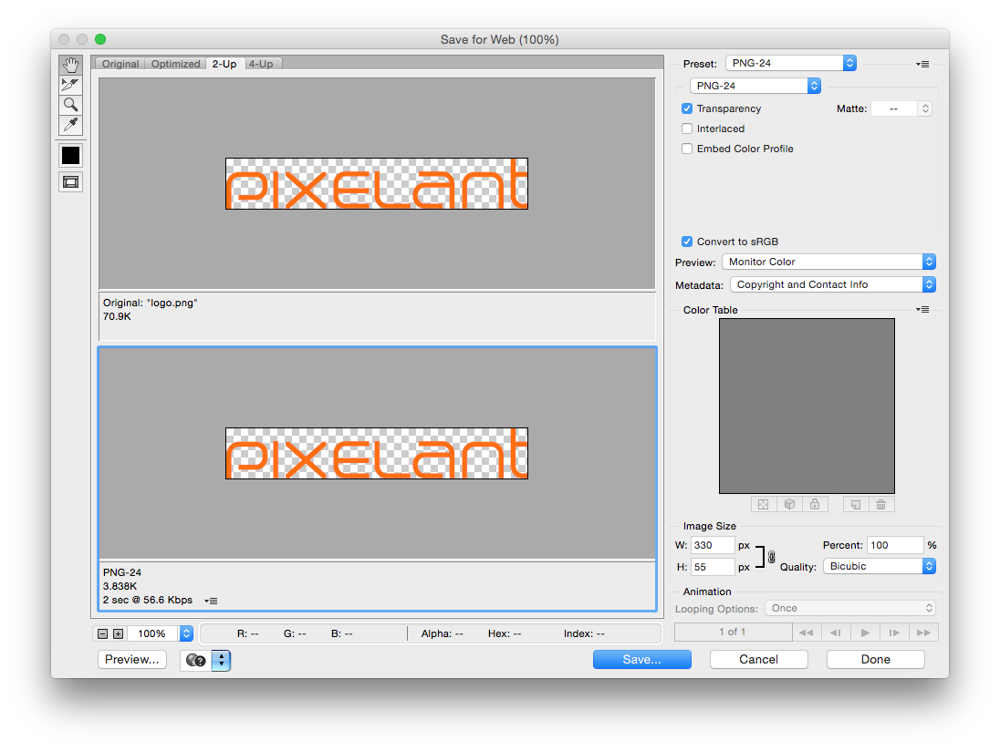
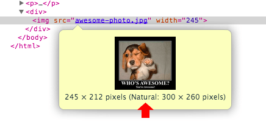

# Pixelant Manual

##Pixelant Code Performance Guide  
###Frontend Workflow


---


###Site performance

* Use PageSpeed Insights  and Pagespeed Optimization to check site’s performance.
* Enable Compression (GZip).  
* Include resources from different domains (subdomains) to provide parallel loading.  
* Omit the protocol portion (http:, https:) from URLs pointing resources
```html
<!-- Not recommended -->
<script src="http://www.google.com/js/gweb/analytics/autotrack.js"></script>
<!-- Recommended -->
<script src="//www.google.com/js/gweb/analytics/autotrack.js"></script>
```


---

###Javascript

* Combine multiple js files into one  
* Minify JavaScript  
  * [UglifyJS](http://lisperator.net/uglifyjs/)   
  * [YUI Compressor ](http://yui.github.io/yuicompressor/)  
* Use JsHint & JSCS  
* https://docs.google.com/a/pixelant.se/document/d/11306kuBBpjFNw0TOZaCCRgm8aHiLJ-WatGcksuFHA4o/edit?usp=sharing  
* Put external scripts after external stylesheets if possible. (better, at the bottom of the **body** tag)  
* Don't use little js scripts (~ 10 lines) in external files (use inline scripts)
* Move the inline scripts after CSS files  
* Use CDN for external scripts if possible (eg google CDN  ) https://developers.google.com/speed/libraries/  
* Defer loading for not very important js scripts (eg third-party scripts for ads, analytics, social widgets, etc)  

---

###CSS

* Stylesheets should always be specified in the head of a document  
* Combine multiple external CSS files into one  
* Minify CSS  
  * [Clean-css](https://github.com/GoalSmashers/clean-css)   
  * [YUI Compressor](http://yui.github.io/yuicompressor/)   
* Remove unused CSS
* https://github.com/giakki/uncss
* CSS Lint 
* https://docs.google.com/a/pixelant.se/document/d/1iZjusxcbNtEfJHkBX9Q5hWXkGzRTjPcJGOyJf19h9wI/edit?usp=sharing
* Don't use little css styles (~20 - 50 lines) in external files (use inline css styles)
* Put external stylesheets before external scripts if possible
* Always Use normal CSS property names with vendor-prefixed ones
* Use css animations instead of js animations


---

###Images

* Supporting

| Format | Transparency | Animation | Browser |
| -- | -- | -- | -- |
| GIF | Yes | Yes | All |
| PNG | Yes | No | All |
| JPEG | No | No | All |
| SVG | Yes | Yes | All |
| JPEG XR | Yes | Yes | IE |
| WebP | Yes | Yes | Chrome, Opera, Android |

* Use optimal format for images:

 

  * Use optimal format for images:
  *  Photos - JPEG, PNG-24  
  * Simple image (few colours) (eg logos) - GIF, PNG-8  
  * Simple image with transparency - GIF, PNG-8  
  * High complexity images with transparency - PNG-24  
  * Logotypes and geometric figures - SVG  
  * WebP and JPEG XR are universally supported, you will need to add additional logic to your application or servers to serve the appropriate resource  
* Use SVG for presenting geometric figures, logotypes  
* Use “Save for Web” in Photoshop to optimize image for your needs


* Compress images:
  * [Jpegtran](http://jpegclub.org/jpegtran/)
  * [Gifsicle](http://www.lcdf.org/gifsicle/)   	
  * [PngQuant](http://pngquant.org/)   	
  * [OptiPng](http://optipng.sourceforge.net/)   	
  * [svgo](https://github.com/svg/svgo/)
* Deliver scaled image assets

Delivering scaled assets is one of the simplest and most effective forms of optimization. Reduce the number of unnecessary pixels by scaling your images to their display size.



High resolution screens enable us to deliver beautiful images, which can be a great product feature. However, high resolution screens also require high-resolution images: prefer vector images whenever possible as they are resolution independent and always deliver sharp results, and if a raster image is required, deliver and optimize multiple variants of each image.

* Use CSS sprites  
* Use  **Data-URI**  
* Use CSS instead images if possible (eg http://one-div.com/ )  
* Use text instead using rasterized text in images  
* Do not use **BMP**s or **TIFF**s  
* Use unicode symbols in html or css instead images if possible:  
  * [Unicode-table](http://unicode-table.com/en/)     
  * [Unicode support](http://unicode.johnholtripley.co.uk/)     
  * [Unicode character recognition](http://shapecatcher.com/)     
* Use special fonts (with icons)  instead images if possible  
  * **[Build Custom Fonts](http://icomoon.io/)**     
* Name your images descriptively for SEO   

You could use, f.e, name, that your camera gave to the image, like “YDXJ0772.jpg”. However, it would be much better to describe this image in name.

* Use ```<caption>``` tag to give extra bit of help for search engines.
* Describe image in ALT tag in several words (6-7 will be enough; a lot of words can be recognized like SPAM) https://support.google.com/webmasters/answer/114016


---

###Fonts

* There are 5 font formats: EOT, TTF, WOFF, WOFF2, SVG
* Browser support

| Font format | IE | Chrome | Firefox | Safari | Opera |
| -- | -- | -- | -- | -- | -- |
| EOT | 6.0 | No | No | No | No |
| TTF | 9.0* | 4.0 | 3.5 | 3.1 | 10.0 |
| WOFF | 9.0 | 5.0 | 3.6 | 5.1 | 11.1 |
| WOFF2 | No | 36.0 | 35.0** | No | 26.0 |
| SVG | No | 4.0 | No | 3.2 | 9.0 |

*IE: The font format only works when set to be "installable". 
  
** Firefox: Not supported by default, but can be enabled (need to set a flag to "true" to use WOFF2).

* SVG now is deprecated in Chrome, don’t use it

* Some font formats require use of GZIP compression

* Always use lowercase letters for the font URL. Uppercase letters can give unexpected results in IE.

```less 
@font-face {
	…
      src: url(‘/fonts/sansation_light.woff’);
	...
}
```

* In the CSS3 @font-face rule you must first define a name for the font (e.g. myFont), and then point to the font file.

```less
@font-face {
      font-family: myFont;
      src: url(‘/fonts/sansation_light.woff’);
...
}
```

* You can add another @font-face rule containing descriptors for other types of text.


```less
@font-face {
      font-family: myFont;
      src: url(‘/fonts/sansation_bold.woff’);
      font-weight: bold;
...
}```
* Compress fonts
  * GZIP for EOT, TTF
  * Zopfli for EOT, TTF, WOFF


* Try to find font locally

```less
@font-face {
      font-family: myFont;
      src: local(‘Sansation’),
      url(‘/fonts/sansation_light.woff2’) format(‘woff2’),
      url(‘/fonts/sansation_light.woff’) format(‘woff’),
...
}
```

* Use format() hint to specify multiple font formats  

```less
@font-face {
      font-family: myFont;
      src: url(‘/fonts/sansation_light.eot’) format(‘embedded-opentype’),
      url(‘/fonts/sansation_light.ttf’) format(‘truetype’),
      url(‘/fonts/sansation_light.woff’) format(‘woff’),
      url(‘/fonts/sansation_light.woff2’) format(‘woff2’);
...
}
```

* Use format() hint to increase loading speed of page  
If font file is not available locally, it iterates over external definitions:

  1. If a format hint is present, the browser checks if it supports this font format before initiating the download, and otherwise advances to the next one.
  2. If a format hint isn’t present, the browser downloads the resource.  


* Declaration order  
The order in which the font variants are declired matters. The browser’ll pick the first format up that it supports. So, if you want the newest browsers to use WOFF2, then you need to place WOFF2 declaration above WOFF, and so on.

```less
@font-face {
font-family: myFont;
      src: url(‘/fonts/sansation_light.woff2’) format(‘woff2’),
      url(‘/fonts/sansation_light.woff’) format(‘woff’),
      url(‘/fonts/sansation_light.ttf’) format(‘truetype’),
      url(‘/fonts/sansation_light.eot’) format(‘embedded-opentype’);
...
}
````

* Use Unicode-range subsetting  
The unicode-range descriptor annows us to specify a comma-delimited list of range values.

```less
@font-face {
      font-family: myFont;
      src: url(‘/fonts/sansation_light.woff2’) format(‘woff2’);
      unicode-range: U+000-5FF, U+ff??;
...
}
```
Because old browsers are not smart enough to select just the necessary subsets and cannot construct a composite font, we have to fallback to providing a single font resource that contains all necessary subsets, and hide the rest from the browser.  
For example, if the page is only using Latin characters, then we can strip other glyphs and serve that particular subset as a standalone resource.

* Use [Font Loading API](http://dev.w3.org/csswg/css-font-loading/) to controll font downloading and optimise rendering   
This API is still under development in some browsers, so you can use this tools:
  1. FontLoader polyfill
 2. webfontloader


